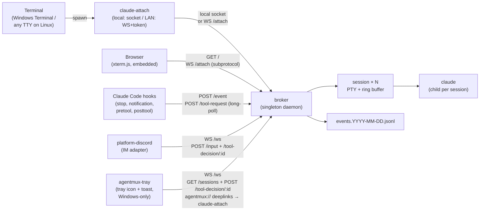

<p align="center">
  <h1 align="center">agentmux</h1>
  <p align="center">
    <strong>tmux-style multiplexer for Claude Code: detachable PTY sessions, HTTP control, hook-driven events.</strong>
  </p>
  <p align="center">
    
    
    <a href="https://claude.ai/code"></a>
    <a href="README.zh-CN.md"></a>
  </p>
</p>

---

agentmux turns Claude Code into an always-on, multi-session background service. A long-running broker daemon owns one ConPTY per session and the `claude` child inside it; viewers (`claude-attach.exe`) come and go without disturbing the running model. Closing the terminal does not kill the session — reopen it later, pick a session from the menu, and the last ~512 KB of TUI output replays so you walk back into a live screen, not a blank prompt.

## Highlights

- **Sessions outlive their viewers.** Each session owns a PTY (ConPTY on Windows, openpty on Unix via `portable-pty`) and a per-session ring buffer; closing the terminal window detaches the viewer but leaves the broker, the PTY, and the `claude` child untouched. Reattach later and the ring replays the last screen, so the TUI is already mid-conversation when you arrive — no `--resume`, no scrollback hunt.
- **Multi-session, switchable from a menu.** N concurrent `claude` instances, each with its own cwd, history, and Claude session id. `claude-attach.exe` shows a session picker on launch (`--new [NAME]` to create, `--session NAME` to skip the menu). Multiple viewers can attach to the same session — input is merged in arrival order, and resize is coordinated to the smallest pane so claude never overflows a tiny window.
- **Ctrl+C escalation.** In raw terminal mode the viewer counts Ctrl+C presses within a 1.5 s window: **1** forwards `0x03` to claude (interrupt the turn), **2** restarts the underlying claude process, **3** shuts the broker down. **Ctrl+Q** / **Ctrl+]** detach the viewer only.
- **HTTP control plane + WS event bus.** `127.0.0.1:8765` exposes full session lifecycle (`/sessions` CRUD, `/interrupt` `/restart` `/hibernate` `/input` `/persist`), the `/event` hook-ingest endpoint, the `/ws` event-stream subscriber, the `/tool-request` long-poll for synchronous PreToolUse approval, and `/attach` for remote viewers (see *Remote viewer over LAN* below).
- **Discord IM bridge (built-in).** `platform-discord.exe` subscribes to the WS bus and forwards Discord messages back through `/sessions/:id/input`. Includes:
  - **Per-channel session bindings** — each Discord channel maps to one session, persisted to disk so a bot restart preserves the topology
  - **Edit-in-place replies with live progress streaming** — every forwarded message gets an immediate `💭 working…` placeholder. As claude runs tools (Edit / Bash / Grep / WebFetch / …), each `PostToolUse` hook firing edits the placeholder body in place to add a one-liner narration (`✏️ edit src/x.rs`, `🖥 $ cargo test`, `🔎 grep …`). When the turn completes, the whole progress timeline is replaced with claude's actual answer. Throttled to one edit per 800 ms so fast tool bursts stay under Discord's per-message edit rate limit.
  - **Reply-thread routing** — Discord-replying to an old assistant message sends your new turn to *that* session, optionally with the quoted text injected as context
  - **Reaction commands** — react 🛑 / 💤 / 🔄 on any bot message to interrupt / hibernate / restart its session
  - **`@mention` wake** — opt-in to make the bot reachable from any channel by mentioning it
  - **DM mode** — opt-in 1:1 conversations with whitelisted users
  - **Attachment forwarding** — drop an image into Discord, the bot saves it locally and tells claude to `Read` it
  - **12 slash commands** with autocomplete on session names: `/ls /attach /new /persist /kill /interrupt /restart /hibernate /logs /cwd /status /help`
  - **Idle-ping suppression** by default (claude code's "Claude is waiting for your input" Notification hook is dropped; permission prompts still pass through)
- **System tray + Windows toast (no IM required).** `agentmux-tray.exe` runs alongside the broker and gives you a **persistent tray icon** colour-coded by session state (green idle / yellow running / red waiting on approval / **purple if any session is locally-owned** / gray broker offline). Right-click for a per-session menu (Attach / Interrupt / Hibernate / Restart / Kill, or Re-adopt for locally-owned sessions), Open web viewer, Stop broker, and **Quit all (broker + discord + tray)** for a one-click full shutdown that also cleans up stray bot processes. Toast notifications for `assistant_message` (click to spawn `claude-attach` for that session via the registered `agentmux://` URL scheme), `notification`, and — the killer feature — `tool_request` toasts with **`[Allow]` / `[Deny]` action buttons**. The tray runs in parallel with Discord; both endpoints race to resolve a tool approval, broker takes whichever decision arrives first. Single-instance handshake via named pipe. Result: at-the-desk users almost never need to open Discord for permissioning.
- **Hook-driven event log.** Four hooks plug into Claude Code's user-global `settings.json`:
  - `hook-stop` — POSTs `assistant_message` events when claude finishes a turn
  - `hook-notification` — POSTs `notification` events for permission prompts / idle pings
  - `hook-pretool` — runs *synchronously* before each tool call; auto-allows safe tools (Read / Glob / Grep / `cargo` / `git status` / …) and asks via Discord/toast for risky ones (`rm -rf`, `curl | sh`, files outside the session cwd, …)
  - `hook-posttool` — fires after each tool call and POSTs `tool_progress` events that drive Discord's edit-in-place narration
  All four bail silently for non-broker claudes via the `AGENT_SESSION_ID` sentinel. With a local viewer attached, the user-facing event is skipped (no double-notify) but a tiny `session_seen` capture event still fires so broker learns claude's session id — required for `agentmux demote` to print the right `--resume` command after a turn that only had a terminal viewer.
- **Tool-use approval, two surfaces.** When `hook-pretool` decides to ask, the broker fans out a `tool_request` event in parallel to Discord (`✅ Allow` / `❌ Deny` button card) and the local tray (Windows toast with the same action buttons via the `agentmux://` URL scheme). The hook long-polls `/tool-request` for up to 5 minutes; whichever endpoint POSTs `/tool-decision/:id` first wins, broker idempotently 404s the loser. Most turns trigger zero prompts; only genuinely risky operations interrupt you. **Discord auto-silences itself when a local viewer (`claude-attach` or web) is attached** — broker still emits the event so tray fires its toast, but the IM card is suppressed because you're already at a screen and don't need a phone ping too. The event payload carries `local_viewer_attached: bool` so any other approval surface can apply the same rule.
- **Hibernate / resume + per-session persist.** Sessions idle past `hibernate_idle_secs` shut their `claude` child down while metadata stays in `sessions.toml`; the next `/input` (or attach) revives the session via `claude --resume <session-id>`. Auto-resume waits for the TUI to settle before injecting input, so the first IM message after a hibernate doesn't get eaten by claude's startup. New sessions default to *ephemeral* (forgotten on broker restart) — flip with `!persist on` / `/persist` / `-persist` flag at create time.
- **Local ↔ broker handover (demote / adopt).** Started a session in your terminal and now want to keep working remotely? Run `.\agentmux adopt --resume <claude-session-id>` after exiting the local `claude` — broker spawns `claude --resume` on the same conversation under its own ConPTY. Going the other way: `.\agentmux demote <name>` injects `/exit` into broker's claude, waits up to 2 s for graceful shutdown (escalates to `TerminateProcess` if needed), and prints a one-liner `cd …; claude --resume <id>` for you to paste into a fresh terminal. While locally-owned, broker refuses `/input`/`/interrupt`/`/restart` with a structured 409 — Discord posts a 💤 reaction (with first-time-only full guidance), tray turns purple and offers "Re-adopt to broker". State survives broker restart so you don't lose channel bindings or session metadata across the round-trip.
- **Remote viewer over LAN (opt-in).** Set `attach_token` and bind `http_addr = "0.0.0.0:8765"` and `claude-attach --broker http://host:8765` connects via WebSocket from another machine. Loopback callers (existing local tooling) bypass the auth check; non-loopback callers must present `Authorization: Bearer <token>`.
- **Browser-based web viewer.** Navigate to `http://<broker>:8765/` from any device (laptop, phone, tablet) — the broker serves a single-file HTML page with xterm.js + the fit addon **embedded into broker.exe** (no CDN dependency, works on isolated networks). Token entry persists to localStorage; loopback browsers skip it entirely. WebSocket auto-reconnect with backoff handles broker restarts without losing scrollback. Touch devices get a soft-key bar with control keys (Esc / Tab / arrows / `^C` `^D` `^L` `^Z`), 28 ASCII punctuation buttons (`, . _ - / : ; ? ! ' " ( ) [ ] { } \ | = + * & < > # @ $` — iOS soft keyboards bury most of these, and several never make it through xterm's input pipeline), a **📋 paste modal** (a visible textarea you long-press-paste into then Send — works around iOS's refusal to long-press-paste into xterm's hidden helper textarea), and **⏫ ⇞ ⇟ ⏬ scroll controls** (xterm's touch-scroll on iOS is sluggish). Auth uses a `Sec-WebSocket-Protocol: bearer.<token>` subprotocol since browsers cannot set the Authorization header on WebSockets.
- **One-command setup.** `.\agentmux init` walks an interactive wizard. Day-to-day is `.\agentmux start | stop | status | attach | logs | config | discord` — config edits are format-preserving via the bundled `agentmux-cli` helper. `.\agentmux config token --set` generates a 32-byte random LAN token and writes it to broker.toml.
- **Singleton broker, daily-rotated logs and audit trail.** A PID file blocks a second broker on the same socket; both `broker.YYYY-MM-DD.log` and `events.YYYY-MM-DD.jsonl` roll daily under the per-user app-data dir (`%LOCALAPPDATA%\agentmux\` on Windows, `~/.local/share/agentmux/` on Linux) with 7-day retention.

## Architecture



## Quick Start

The end-user path is documented in **[QUICKSTART.md](QUICKSTART.md)** —
download a release zip, extract, run `.\agentmux init`. Everything below is
the developer / from-source flow.

### 1. Build

**Windows (full feature set, including tray + toast):**

```powershell
git clone https://github.com/<your-fork>/agentmux.git
cd agentmux
cargo build --release
```

Produces nine binaries in `target\release\`:
`broker`, `claude-attach`, `hook-stop`, `hook-notification`,
`hook-pretool`, `hook-posttool`, `platform-discord`,
`agentmux-tray`, `agentmux-cli`.

**Linux / macOS (broker / viewer / Discord / hooks; no tray):**

```bash
git clone https://github.com/<your-fork>/agentmux.git
cd agentmux
cargo build --release --workspace --exclude agentmux-tray
```

Produces eight binaries in `target/release/` (no `.exe` suffix). The
`agentmux-tray` crate uses Windows-only WinRT toast + tray APIs and
is excluded; everything else compiles on Linux x86_64 and macOS
(Apple Silicon or Intel). Most users on these platforms will rely on
the Discord bot, the browser-based web viewer, or `claude-attach`
over SSH/LAN for at-a-distance access — you don't actually need the
tray to use the daemon.

### 2. First-time setup

**Windows:**

```powershell
.\agentmux init
```

Walks an interactive wizard: prerequisite check → install hooks → write
broker config template → optional Discord setup → start broker. Idempotent;
re-run any time without harm.

**Linux / macOS (manual for now — no `init` wrapper yet):**

```bash
# data dir — Linux: ~/.local/share/agentmux/; macOS: ~/Library/Application Support/agentmux/
mkdir -p "$(case "$(uname -s)" in Darwin) echo "$HOME/Library/Application Support";; *) echo "${XDG_DATA_HOME:-$HOME/.local/share}";; esac)/agentmux"
ROOT="$(pwd)/target/release"                                      # absolute path to your binaries
# Wire the four hooks into ~/.claude/settings.json under "hooks".
# Each hook entry runs the matching binary; the binary itself reads
# AGENT_BROKER_URL (default http://127.0.0.1:8765) to find broker.
# Example settings.json fragment:
#   "hooks": {
#     "Stop":          [{"hooks": [{"type":"command","command":"'$ROOT'/hook-stop"}]}],
#     "Notification":  [{"hooks": [{"type":"command","command":"'$ROOT'/hook-notification"}]}],
#     "PreToolUse":    [{"matcher":"*","hooks":[{"type":"command","command":"'$ROOT'/hook-pretool"}]}],
#     "PostToolUse":   [{"matcher":"*","hooks":[{"type":"command","command":"'$ROOT'/hook-posttool"}]}]
#   }
"$ROOT/broker"                                                    # foreground
# or in another shell, after broker is up:
"$ROOT/claude-attach"                                             # menu picker
```

Linux config files live under `~/.local/share/agentmux/`; macOS at
`~/Library/Application Support/agentmux/` (`config.toml`,
`sessions.toml`, `discord.toml`, `logs/`, …) — the same data as
`%LOCALAPPDATA%\agentmux\` on Windows, just at the platform-native
location.

### 3. Day-to-day

The PowerShell wrapper (`.\agentmux <verb>`) only ships on Windows.
On Linux / macOS the verbs below map directly to invoking the
matching binary; e.g. `agentmux attach default` ≡
`./claude-attach --session default`, `agentmux start` ≡ launching
`./broker` and (optionally) `./platform-discord` as background
processes (`nohup ./broker >/dev/null 2>&1 &` works).

```powershell
.\agentmux start             # broker + tray + Discord bot (if configured)
.\agentmux stop              # all of the above
.\agentmux status            # one-line health summary; locally-owned shown in magenta
.\agentmux attach [name]     # enter the TUI; menu picker if no name
.\agentmux new <name> [-Cwd <path>] [-Persist|-Ephemeral]
                             # create a session (default cwd = config.default_cwd)
.\agentmux kill <name> [-Force]
                             # delete a session record (asks unless -Force)
.\agentmux adopt --resume <claude-session-id> [name] [--cwd <path>]
                             # bring an external claude conversation under broker
.\agentmux adopt <name>      # re-adopt a previously-demoted session
.\agentmux demote <name>     # hand a session back to local terminal control
.\agentmux logs broker       # also: discord, tray, events
.\agentmux help              # full command list
```

After `start`, look at the **Windows system tray (right side of the
taskbar)** — a small coloured circle is the agentmux tray icon. Right-click
for the per-session menu; toasts pop up on `assistant_message` and tool-
approval prompts. `--no-tray` opts out, `--no-discord` skips the IM bot.

`.\agentmux start --foreground` runs the broker inline (Ctrl+C to stop) for
debugging — panics and tracing output land in the current shell instead of
log files.

For a viewer that runs in any modern browser (no install, mobile-friendly),
navigate to `http://<broker>:8765/` after starting the broker. Loopback
browsers skip the token prompt; LAN browsers pick the same `attach_token`
used by `claude-attach --broker`.

### 4. Configuration helpers

```powershell
.\agentmux config check                     # validate all configs
.\agentmux config edit [broker|discord|hooks]
.\agentmux config dir                       # open %LOCALAPPDATA%\agentmux
.\agentmux config set broker http_addr 127.0.0.1:9000
.\agentmux discord users add  123456789012345678
.\agentmux discord channels remove 987654321098765432
```

TOML edits go through `agentmux-cli` and preserve the original comments and
formatting. `config check` parses each file and reports `✓` / `⚠` / `✗`
lines you can paste into a bug report.

### 5. Discord commands cheat sheet

Inside any channel the bot can read (text or `!`-prefix; equivalent slash commands also exist with autocomplete):

```
plain text                 → forward to this channel's bound session
!attach <name>             → bind THIS channel to a session (autocomplete on /attach)
!new [name] [-cwd path]    → create a session and bind it (-ephemeral / -persist override default)
!persist on | off          → toggle whether this channel's session survives broker restart
!cwd                       → show the bound session's working directory
!logs [n]                  → last n lines of session output (default 30, max 100)
!ls                        → list sessions; ▶ marks this channel's binding; lists other channel bindings
!status                    → show this channel's binding
!interrupt | !restart | !hibernate
!kill <name>               → destroy a session (autocomplete on /kill); channels lose their binding
!help                      → all of the above
```

React on any bot message with **🛑** (interrupt) / **💤** (hibernate) / **🔄** (restart) — same effect as the corresponding command, no typing.

Reply to a bot message (Discord's reply UI) to forward your new turn to *that* session, regardless of the channel binding.

### 6. Remote viewer over LAN

```powershell
# On the broker host:
.\agentmux config token --set                                # generate + persist token
.\agentmux config set broker http_addr "0.0.0.0:8765"        # bind LAN
.\agentmux stop ; .\agentmux start                           # apply
# Open Windows Defender Firewall port 8765 inbound, scoped to your subnet.

# On the second machine (token generated above):
$env:AGENT_ATTACH_TOKEN = "rjVBS19l...43chars..."
.\claude-attach.exe --broker http://192.168.0.42:8765 --session default
```

Loopback callers (your Discord bot on the broker host, hooks, local `claude-attach`) bypass the auth check, so existing local setups keep working unchanged.

### 7. Cutting a release

```powershell
.\scripts\build-release.ps1
# → dist\agentmux-vX.Y.Z-windows-x86_64.zip
```

```bash
bash scripts/build-release.sh
# → dist/agentmux-vX.Y.Z-linux-x86_64.tar.gz   (on Linux x86_64)
# → dist/agentmux-vX.Y.Z-macos-aarch64.tar.gz  (on Apple Silicon)
# → dist/agentmux-vX.Y.Z-macos-x86_64.tar.gz   (on Intel Mac)
```

`build-release.sh` detects the host OS + architecture via `uname` and
names the tarball accordingly; one script handles all three Unix
targets. Pushing a `v*` tag triggers `.github/workflows/release.yml`,
which runs the three packaging scripts in parallel — Windows zip on a
`windows-latest` runner, Linux tarball on `ubuntu-latest`, macOS
tarball on `macos-latest` (Apple Silicon by default) — and attaches
all archives plus their `.sha256` checksums to a single GitHub
Release. (`workflow_dispatch` is also wired so you can fire it
manually.)

### 8. Add the Windows Terminal profile (optional)

`scripts/terminal-profile.json` is a profile snippet — replace `<INSTALL_DIR>`
with the absolute path to your agentmux folder, then paste the object into
Windows Terminal's `settings.json` under `profiles.list`. Selecting the
"agentmux" profile launches `claude-attach.exe` straight into the session
menu.

## Configuration

`broker` and `claude-attach` resolve config in this order (first hit wins):

1. `AGENT_CONFIG` env var → that file's path
2. `<local-appdata>/agentmux/config.toml`, where `<local-appdata>` is:
    - **Windows:** `%LOCALAPPDATA%\agentmux\` (e.g. `C:\Users\you\AppData\Local\agentmux\`)
    - **Linux:** `$XDG_DATA_HOME/agentmux/` (default `~/.local/share/agentmux/`)
    - **macOS:** `~/Library/Application Support/agentmux/`
3. baked-in defaults

`.\scripts\init-config.ps1` writes a fully-commented template at the
default path on Windows. On Linux / macOS, write your own
`config.toml` at the platform-native location above (every field is
optional — unset means default).

### `broker` config (`config.toml`)

| Key | Default | Meaning |
|---|---|---|
| `http_addr` | `127.0.0.1:8765` | Broker HTTP / WS bind address. Set `0.0.0.0:8765` for LAN (then **`attach_token` is mandatory**). |
| `pipe_name` | `claude-broker` | Local-socket name (`\\.\pipe\<name>` on Windows, abstract Unix socket on Linux) shared by broker and local viewers. Bare name; legacy `\\.\pipe\<name>` values from older configs are auto-stripped on load |
| `default_command` | `["claude", "--dangerously-skip-permissions"]` | argv used to spawn each session |
| `ring_cap_bytes` | `524288` | Per-session replay buffer size |
| `hibernate_idle_secs` | `86400` | Auto-hibernate idle sessions after this many seconds (0 = off) |
| `auto_resume_default` | `false` | When `true`, new sessions persist to disk by default; per-session flag still wins |
| `attach_token` | (empty) | Bearer token for non-loopback HTTP/WS. Empty = LAN access disabled. Generate via `.\agentmux config token --set` |
| `default_cwd` | (empty) | Default working directory for newly-created sessions when the caller doesn't specify one. Empty = use broker's launch cwd (legacy). Set this so new-session cwd doesn't depend on which directory you happened to be in when running `.\agentmux start`. The init wizard prompts for this. |
| `sessions_toml_path` | `%LOCALAPPDATA%\agentmux\sessions.toml` | Override session persistence file |
| `pid_file_path` | `%LOCALAPPDATA%\agentmux\broker.pid` | Override singleton lock file |
| `log_dir` | `%LOCALAPPDATA%\agentmux\logs` | Override daily-rolling log directory |

### `discord` config (`discord.toml`)

| Key | Default | Meaning |
|---|---|---|
| `token_env` | `DISCORD_BOT_TOKEN` | Name of the env var that holds the bot token (token never on disk) |
| `broker_http_url` | `http://127.0.0.1:8765` | Broker HTTP base; cross-host setups change host |
| `broker_ws_url` | `ws://127.0.0.1:8765/ws` | Broker WS event stream |
| `channel_ids` | `[]` | Whitelisted server channel IDs (empty = all visible server channels) |
| `allowed_user_ids` | `[]` | **Required, non-empty.** Whitelisted Discord user IDs whose messages the bot acts on |
| `default_session` | `default` | Session a new channel is auto-bound to on first message |
| `max_message_chars` | `1900` | Discord 2000-char split point with margin for decorators |
| `allow_dm` | `false` | Accept 1:1 DMs from whitelisted users |
| `notify_on_idle` | `false` | Forward "Claude is waiting for your input" pings (most users find these noisy) |
| `respond_to_mentions` | `false` | `@bot` in non-whitelisted server channels still wakes the bot |
| `slash_command_guild_id` | `0` | Pin slash-command registration to one guild for instant updates (0 = global, ~1h propagation) |
| `reply_quote_in_prompt` | `true` | When you Discord-reply to a message, prepend `[replying to: "…"]` to claude's prompt |
| `react_with_actions` | `true` | 🛑 / 💤 / 🔄 reactions on bot messages map to interrupt / hibernate / restart |

## HTTP API

All endpoints are loopback-only by default. When `attach_token` is set and `http_addr` binds to a non-loopback interface, non-loopback callers must include `Authorization: Bearer <attach_token>`.

| Method | Path | Purpose |
|---|---|---|
| `GET` | `/sessions` | List all sessions (id, name, cwd, viewers, state, auto_resume, claude_session_id). State is one of `idle` / `hibernated` / `crashed` / `locally_owned` |
| `POST` | `/sessions` | Create a session (`{"name", "cwd"?, "auto_resume"?, "resume_session_id"?}`); `auto_resume` defaults to `auto_resume_default`; `resume_session_id` (Claude's UUID) makes broker spawn `claude --resume <id>` to adopt an existing conversation |
| `GET` | `/sessions/:key` | Inspect one session (key = id or name) |
| `DELETE` | `/sessions/:key?force=true` | Kill the session |
| `GET` | `/sessions/:key/state` | Lightweight liveness / idle / viewer-count probe |
| `POST` | `/sessions/:key/interrupt` | Send `0x03` to the session's PTY (== Ctrl+C inside claude). Returns 409 with structured `{"error":"locally_owned",…}` body if session is locally-owned |
| `POST` | `/sessions/:key/restart` | Kill and respawn the claude child, preserving session id. 409 on locally-owned |
| `POST` | `/sessions/:key/hibernate` | Stop the claude child but keep metadata for later resume. 409 on locally-owned |
| `POST` | `/sessions/:key/demote` | Hand a session back to local terminal: inject `/exit\r` into claude (graceful, 2 s window), escalate to `TerminateProcess` if needed (1 s window), 500 if claude survives both. On success: drops PTY, transitions to `LocallyOwned`, returns `{claude_session_id, cwd, graceful, suggested_command}` |
| `POST` | `/sessions/:key/adopt` | Re-adopt a `LocallyOwned` session: spawn claude under broker with `--resume <stored-id>`. Caller is responsible for having exited any local `claude --resume` first |
| `POST` | `/sessions/:key/input` | Inject text into a session's PTY stdin (`{"text", "append_enter"?}`). Auto-resumes Hibernated/Crashed. Returns 409 with `{"error":"locally_owned",…}` body if locally-owned. The trailing `\r` is written **after** the text payload with a 30 ms gap so claude code's TUI doesn't bundle them into one paste-burst (which would skip the submit) |
| `POST` | `/sessions/:key/persist` | Toggle the per-session `auto_resume` flag (`{"auto_resume": bool}`) and re-save sessions.toml |
| `GET` | `/sessions/:key/ring` | Diagnostic: raw ring-buffer snapshot — pipe through `xxd` / `od -c` |
| `POST` | `/event` | Hook ingestion endpoint — appends to `events.YYYY-MM-DD.jsonl` and tees to `/ws` |
| `POST` | `/tool-request` | **Long-poll up to 5 min.** Hook-pretool POSTs `{ session_id, tool_name, tool_input }`; broker generates a UUID, broadcasts a `tool_request` event (with `local_viewer_attached: bool` so Discord can self-suppress when a viewer is up), awaits `/tool-decision/:id`, returns `{ allow, reason }`. Timeout returns `{ allow: false, reason: "no human decision within 300s" }` |
| `POST` | `/tool-decision/:request_id` | Resolve a parked `/tool-request` (`{"allow": bool, "reason"?}`) |
| `GET` | `/ws` | WebSocket bus — every annotated hook event is pushed as one JSON line per subscriber |
| `GET` | `/attach` | WebSocket viewer transport. Each frame (HELLO / PTY_DATA / RESIZE / CONTROL) rides as one Binary message. Used by `claude-attach --broker` over LAN and the browser viewer (auth via `Sec-WebSocket-Protocol: bearer.<token>` subprotocol since browsers cannot set the `Authorization` header on WebSockets) |
| `GET` | `/`, `/web`, `/web/` | Browser web viewer — single-file HTML inlined into broker.exe. **Public** (no auth) so the user can load the page before pasting their token; privileged calls inside the page (`/sessions`, `/attach`) still go through the auth middleware |
| `GET` | `/web/vendor/*` | Embedded xterm.js + addon-fit + xterm.css (~290 KB, baked in via `include_bytes!`). Served with `Cache-Control: public, max-age=86400` |
| `POST` | `/shutdown` | Graceful broker shutdown (kill all claudes, drain, exit) |

## Crates

| Crate | Role |
|---|---|
| `broker` | Multi-session daemon. Owns the PTY pool (ConPTY on Windows, openpty on Unix via `portable-pty`), ring buffers, local-socket server (`interprocess` — Win32 named pipe on Windows, Unix domain socket on Linux), HTTP control plane (auth-middleware-protected), WS event bus, WS attach endpoint, hibernate scanner, decision-channel registry for PreToolUse, daily-rolling events log |
| `claude-attach` | Terminal viewer. Frame-protocol client with two transports: local socket (default, on-host) and WebSocket (`--broker http://host:port --token …` for LAN). Session-picker menu, raw-mode stdin forwarding (cross-platform via `crossterm`), Ctrl+C escalation, resize coordination |
| `platform-discord` | Discord IM adapter. Per-channel session bindings (persisted), edit-in-place placeholders with live tool-progress narration, reply-thread routing with optional quote injection, attachment forwarding (image/text), 12 slash commands with autocomplete, reaction commands, tool-use approval buttons, idle-ping suppression, mention wake, DM mode, orphan-placeholder recovery |
| `agentmux-tray` | **Windows-only.** System-tray icon + Windows toast notifications. Subscribes to `/ws` for live events, polls `/sessions` for menu state. Per-session right-click submenu; toasts on `assistant_message` / `notification` / `tool_request` (with `[Allow]` `[Deny]` action buttons via the `agentmux://` URL scheme). Single-instance handshake (named pipe), HKCU URL-scheme registration on first run. Excluded from Linux builds |
| `hook-stop` | Claude Code `Stop` hook. Reads transcript, posts `assistant_message` to broker. Always emits a tiny internal `session_seen` event first (so broker learns claude's session id even when the user-facing event is suppressed). Bails silently for the user-facing event when a local viewer is attached |
| `hook-notification` | Claude Code `Notification` hook. Same `session_seen` capture, posts `notification` events for permission prompts / idle pings |
| `hook-pretool` | Claude Code `PreToolUse` hook. Smart classifier auto-allows safe tools and dev-flow `Bash` patterns; long-polls `/tool-request` for the rest. Fails open on broker outage so claude isn't blocked by infrastructure failure |
| `hook-posttool` | Claude Code `PostToolUse` hook. Posts `tool_progress` events that drive Discord's edit-in-place narration (`✏️ edit src/x.rs`, `🖥 $ cargo test`, …). Fail-open + local-viewer-bail like the others |
| `agentmux-cli` | Helper for format-preserving TOML edits and per-kind config validation. Invoked by `agentmux.ps1` on Windows; usable directly as `./agentmux-cli ...` on Linux / macOS |
| `shared` | Wire protocol (frame tags, HELLO / RESIZE / CONTROL / PTY_DATA, encode/decode-frame for WS), config loader, minimal blocking HTTP client (with optional Bearer auth + long-poll variant) |

## Repository layout

```
agentmux/
├── agentmux.ps1            # Windows entrypoint — wraps the scripts below
├── QUICKSTART.md           # 1-page user-facing onboarding
├── crates/
│   ├── broker/             # Multi-session daemon
│   │   └── web/            # Browser viewer (HTML + vendored xterm.js)
│   ├── claude-attach/      # Terminal viewer (pipe + WS transports)
│   ├── platform-discord/   # Discord IM adapter (with tool-progress streaming)
│   ├── agentmux-tray/      # System tray + Windows toast notifications
│   ├── hook-stop/          # Stop hook → assistant_message
│   ├── hook-notification/  # Notification hook → notification
│   ├── hook-pretool/       # PreToolUse hook → tool_request (synchronous approval)
│   ├── hook-posttool/      # PostToolUse hook → tool_progress (live narration)
│   ├── agentmux-cli/       # TOML helper (config set/check/array-add etc.)
│   └── shared/             # Wire protocol + config + http client
├── scripts/
│   ├── start-broker.ps1    # also accepts -Foreground
│   ├── start-discord.ps1
│   ├── start-tray.ps1
│   ├── stop-broker.ps1
│   ├── install-hooks.ps1
│   ├── init-config.ps1
│   ├── init-discord-config.ps1
│   ├── open-config-dir.ps1
│   ├── build-release.ps1   # produces dist\agentmux-vX.Y.Z-windows-x86_64.zip
│   ├── build-release.sh    # produces dist/agentmux-vX.Y.Z-linux-x86_64.tar.gz
│   └── terminal-profile.json
├── .github/workflows/
│   └── release.yml         # Tag-triggered Windows + Linux build → GitHub release
└── PLAN.md                 # Design doc + phase-by-phase implementation log
```

## Requirements

- **Windows 10/11** for the full feature set (broker + viewer + Discord +
  hooks + tray + Windows toast), or **Linux x86_64** / **macOS** (Apple
  Silicon or Intel) for everything except the tray (the Unix builds
  exclude `agentmux-tray`; broker, viewer, hooks, Discord, and the web
  viewer all run headless on a server). The macOS path is exercised in
  CI on every release tag but the maintainer doesn't run macOS daily, so
  user reports / PRs are how regressions get caught.
- **Rust 1.75+**. On Windows, MSVC toolchain (Visual Studio 2022 Build
  Tools, "Desktop development with C++"). On Linux / macOS, the
  standard `rustup default stable` is enough (Linux needs no extra
  system libs; macOS needs Xcode Command Line Tools, install via
  `xcode-select --install`). Only needed for *building*; the release
  archives are self-contained.
- **Claude Code CLI** on `PATH` — broker spawns `claude` as the default command

## Safety

- **Default-loopback.** HTTP control plane and the local socket both bind to `127.0.0.1` (resp. an abstract Unix socket name on Linux) out of the box — not reachable from the network. LAN access is opt-in via `http_addr = "0.0.0.0:8765"` **and** a non-empty `attach_token`; without the token, every non-loopback request is rejected with 401 (logged with source IP).
- **Constant-time token comparison** for the bearer check.
- **Loopback exemption** for the auth middleware so existing local tooling (the Discord bot on the same host, hooks, claude-attach over the local socket) keeps working without any token configured.
- **PreToolUse fail-open.** When the broker is unreachable, `hook-pretool` allows the tool through rather than block claude on broken infrastructure. Set `AGENT_HOOK_DEBUG` to surface the fail-open reason on stderr (visible to humans, not to claude).
- **Default command** is `claude --dangerously-skip-permissions`. The PreToolUse approval flow is intended to *replace* claude's own permission prompts with a more flexible regex-driven one; if you'd rather use claude's built-in prompts instead, override `default_command` in `config.toml` and disable / uninstall the PreToolUse hook.
- **PID-file singleton** prevents two brokers from racing on the same pipe.
- **Token never on disk for Discord.** The bot token lives in a User-scope env var (default `DISCORD_BOT_TOKEN`); only the env-var *name* is in `discord.toml`.

## License

TBD.
