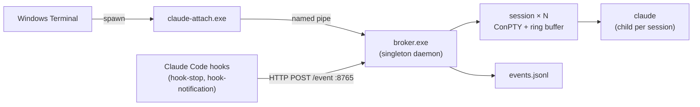

<p align="center">
  <h1 align="center">agentmux</h1>
  <p align="center">
    <strong>tmux-style multiplexer for Claude Code: detachable PTY sessions, HTTP control, hook-driven events.</strong>
  </p>
  <p align="center">
    
    
    <a href="https://claude.ai/code"></a>
    <a href="README.zh-CN.md"></a>
  </p>
</p>

---

agentmux turns Claude Code into an always-on, multi-session background service. A long-running broker daemon owns one ConPTY per session and the `claude` child inside it; viewers (`claude-attach.exe`) come and go without disturbing the running model. Closing the terminal does not kill the session — reopen it later, pick a session from the menu, and the last ~512 KB of TUI output replays so you walk back into a live screen, not a blank prompt.

## Highlights

- **Sessions outlive their viewers.** Each session owns a ConPTY and a per-session ring buffer; closing the Windows Terminal window detaches the viewer but leaves the broker, the PTY, and the `claude` child untouched. Reattach later and the ring replays the last screen, so the TUI is already mid-conversation when you arrive — no `--resume`, no scrollback hunt.
- **Multi-session, switchable from a menu.** N concurrent `claude` instances, each with its own cwd, history, and Claude session id. `claude-attach.exe` shows a session picker on launch (`--new [NAME]` to create, `--session NAME` to skip the menu). Multiple viewers can attach to the same session — input is merged in arrival order, and resize is coordinated to the smallest pane so claude never overflows a tiny window.
- **Ctrl+C escalation.** In raw terminal mode the viewer counts Ctrl+C presses within a 1.5 s window: **1** forwards `0x03` to claude (interrupt the turn), **2** restarts the underlying claude process, **3** shuts the broker down. **Ctrl+Q** / **Ctrl+]** detach the viewer only. No separate `!stop` / `!kill` syntax to memorize.
- **HTTP control plane.** `127.0.0.1:8765` exposes session CRUD plus `/state`, `/interrupt`, `/restart`, `/hibernate`, `/shutdown` — external automation can drive sessions without speaking the TUI.
- **Hook-driven event log.** `hook-stop.exe` and `hook-notification.exe` plug into Claude Code's user-global `settings.json` and POST `assistant_message` / `notification` events to the broker, which appends them to `events.jsonl` for downstream consumers (IM bridges, dashboards). Hooks bail silently for non-broker claudes via the `AGENT_SESSION_ID` sentinel, and skip when a local viewer is already attached — they never double-notify.
- **Hibernate / resume.** Sessions idle past `hibernate_idle_secs` shut their `claude` child down to free memory while metadata stays in `sessions.toml`; the next attach revives the session via `claude --resume <session-id>`.
- **Singleton broker, daily-rotated logs.** A PID file under `%LOCALAPPDATA%\agentmux\` blocks a second broker on the same pipe; logs roll daily under `%LOCALAPPDATA%\agentmux\logs\`, kept 7 days.

## Architecture



## Quick Start

### 1. Build

```powershell
git clone https://github.com/<your-fork>/agentmux.git
cd agentmux
cargo build --release
```

Produces `target/release/{broker,claude-attach,hook-stop,hook-notification}.exe`.

### 2. Start the broker

```powershell
.\scripts\start-broker.ps1
# broker started: pid 12345
#   cwd:    G:\Claude\agentmux
#   pid:    C:\Users\<you>\AppData\Local\agentmux\broker.pid
#   logs:   C:\Users\<you>\AppData\Local\agentmux\logs
```

The broker's working directory becomes `claude`'s cwd, which decides the "trust this directory?" prompt and the project the model sees. To retarget, stop the broker (`.\scripts\stop-broker.ps1`) and relaunch with `-WorkingDirectory <path>`.

### 3. Install hooks (one-time, optional)

```powershell
.\scripts\install-hooks.ps1
```

Idempotent merge into `~\.claude\settings.json` (backed up to `settings.json.bak` first). After this, every `claude` you spawn anywhere on the machine fires the hooks — but only sessions started by the broker (which sets `AGENT_SESSION_ID`) actually report; the rest exit silently. Remove with `.\scripts\install-hooks.ps1 -Uninstall`.

### 4. Add the Windows Terminal profile (optional)

`scripts/terminal-profile.json` is a profile snippet — replace `<INSTALL_DIR>` with the absolute path to your agentmux clone, then paste the object into Windows Terminal's `settings.json` under `profiles.list`. Selecting the "agentmux" profile launches `claude-attach.exe` straight into the session menu.

### 5. Attach

```powershell
.\target\release\claude-attach.exe                # menu picker
.\target\release\claude-attach.exe --session foo  # attach directly to "foo"
.\target\release\claude-attach.exe --new bar      # create "bar" and attach
```

Detach with **Ctrl+Q** or **Ctrl+]**, or just close the terminal — the session keeps running. Reattach later and the ring buffer replays the last screen.

## Configuration

`broker.exe` and `claude-attach.exe` resolve config in this order (first hit wins):

1. `AGENT_CONFIG` env var → that file's path
2. `%LOCALAPPDATA%\agentmux\config.toml`
3. baked-in defaults

`.\scripts\init-config.ps1` writes a fully-commented template at the default path. Every field is optional — unset means default.

| Key | Default | Meaning |
|---|---|---|
| `http_addr` | `127.0.0.1:8765` | Broker HTTP control plane bind address |
| `pipe_name` | `\\.\pipe\claude-broker` | Named pipe between broker and viewers |
| `default_command` | `["claude", "--dangerously-skip-permissions"]` | argv used to spawn each session |
| `ring_cap_bytes` | `524288` | Per-session replay buffer size |
| `hibernate_idle_secs` | `86400` | Auto-hibernate idle sessions after this many seconds (0 = off) |
| `sessions_toml_path` | `%LOCALAPPDATA%\agentmux\sessions.toml` | Override session persistence file |
| `pid_file_path` | `%LOCALAPPDATA%\agentmux\broker.pid` | Override singleton lock file |
| `log_dir` | `%LOCALAPPDATA%\agentmux\logs` | Override daily-rolling log directory |

## HTTP API

| Method | Path | Purpose |
|---|---|---|
| `GET` | `/sessions` | List all sessions (id, name, cwd, viewers, state) |
| `POST` | `/sessions` | Create a session (`{"name", "cwd"?, "command"?}`) |
| `GET` | `/sessions/:key` | Inspect one session (key = id or name) |
| `DELETE` | `/sessions/:key?force=true` | Kill the session |
| `GET` | `/sessions/:key/state` | Lightweight liveness / idle / viewer-count probe |
| `POST` | `/sessions/:key/interrupt` | Send `0x03` to the session's PTY (== Ctrl+C inside claude) |
| `POST` | `/sessions/:key/restart` | Kill and respawn the claude child, preserving session id |
| `POST` | `/sessions/:key/hibernate` | Stop the claude child but keep metadata for later resume |
| `POST` | `/event` | Hook ingestion endpoint — appends one line to `events.jsonl` |
| `POST` | `/shutdown` | Graceful broker shutdown (SIGTERM all claudes, drain, exit) |

## Crates

| Crate | Role |
|---|---|
| `broker` | Multi-session daemon. Owns the ConPTY pool, ring buffers, named-pipe server, HTTP control plane, hibernate scanner, crash watcher, and `events.jsonl` writer |
| `claude-attach` | Terminal viewer. Frame-protocol client over the named pipe with session-picker menu, raw-mode stdin forwarding, Ctrl+C escalation, and resize coordination |
| `hook-stop` | Claude Code `Stop` hook. Reads transcript, posts `assistant_message` to broker. Bails silently when a local viewer is attached |
| `hook-notification` | Claude Code `Notification` hook. Posts `notification` events to broker |
| `shared` | Wire protocol (frame tags, HELLO / RESIZE / CONTROL / PTY_DATA), config loader, minimal blocking HTTP client |

## Repository layout

```
agentmux/
├── crates/
│   ├── broker/             # Multi-session daemon
│   ├── claude-attach/      # Terminal viewer
│   ├── hook-stop/          # Stop hook → assistant_message
│   ├── hook-notification/  # Notification hook → notification
│   └── shared/             # Wire protocol + config + http client
├── scripts/
│   ├── start-broker.ps1
│   ├── stop-broker.ps1
│   ├── install-hooks.ps1
│   ├── init-config.ps1
│   ├── open-config-dir.ps1
│   └── terminal-profile.json   # Windows Terminal profile template
└── PLAN.md                 # Design doc + phase-by-phase implementation log
```

## Requirements

- **Windows 10/11** — relies on ConPTY and Win32 named pipes; not portable to Unix
- **Rust 1.75+** for compilation
- **Claude Code CLI** on `PATH` — broker spawns `claude` as the default command

## Safety

- HTTP control plane and named pipe both bind to **loopback / local-only** — not reachable from the network.
- The default command is `claude --dangerously-skip-permissions`. Override `default_command` in `config.toml` if that's not what you want.
- The PID-file singleton prevents two brokers from racing on the same pipe.

## License

TBD.
