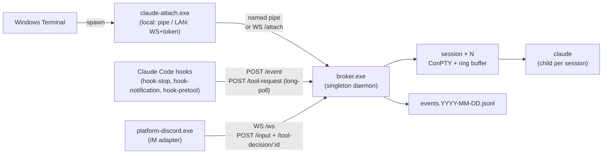

<p align="center">
  <h1 align="center">agentmux</h1>
  <p align="center">
    <strong>tmux-style multiplexer for Claude Code: detachable PTY sessions, HTTP control, hook-driven events.</strong>
  </p>
  <p align="center">
    
    
    <a href="https://claude.ai/code"></a>
    <a href="README.zh-CN.md"></a>
  </p>
</p>

---

agentmux turns Claude Code into an always-on, multi-session background service. A long-running broker daemon owns one ConPTY per session and the `claude` child inside it; viewers (`claude-attach.exe`) come and go without disturbing the running model. Closing the terminal does not kill the session — reopen it later, pick a session from the menu, and the last ~512 KB of TUI output replays so you walk back into a live screen, not a blank prompt.

## Highlights

- **Sessions outlive their viewers.** Each session owns a ConPTY and a per-session ring buffer; closing the Windows Terminal window detaches the viewer but leaves the broker, the PTY, and the `claude` child untouched. Reattach later and the ring replays the last screen, so the TUI is already mid-conversation when you arrive — no `--resume`, no scrollback hunt.
- **Multi-session, switchable from a menu.** N concurrent `claude` instances, each with its own cwd, history, and Claude session id. `claude-attach.exe` shows a session picker on launch (`--new [NAME]` to create, `--session NAME` to skip the menu). Multiple viewers can attach to the same session — input is merged in arrival order, and resize is coordinated to the smallest pane so claude never overflows a tiny window.
- **Ctrl+C escalation.** In raw terminal mode the viewer counts Ctrl+C presses within a 1.5 s window: **1** forwards `0x03` to claude (interrupt the turn), **2** restarts the underlying claude process, **3** shuts the broker down. **Ctrl+Q** / **Ctrl+]** detach the viewer only.
- **HTTP control plane + WS event bus.** `127.0.0.1:8765` exposes full session lifecycle (`/sessions` CRUD, `/interrupt` `/restart` `/hibernate` `/input` `/persist`), the `/event` hook-ingest endpoint, the `/ws` event-stream subscriber, the `/tool-request` long-poll for synchronous PreToolUse approval, and `/attach` for remote viewers (see *Remote viewer over LAN* below).
- **Discord IM bridge (built-in).** `platform-discord.exe` subscribes to the WS bus and forwards Discord messages back through `/sessions/:id/input`. Includes:
  - **Per-channel session bindings** — each Discord channel maps to one session, persisted to disk so a bot restart preserves the topology
  - **Edit-in-place replies** — every forwarded message gets an immediate `💭 working…` placeholder that's edited into the final answer when claude finishes (with a typing indicator on the way)
  - **Reply-thread routing** — Discord-replying to an old assistant message sends your new turn to *that* session, optionally with the quoted text injected as context
  - **Reaction commands** — react 🛑 / 💤 / 🔄 on any bot message to interrupt / hibernate / restart its session
  - **`@mention` wake** — opt-in to make the bot reachable from any channel by mentioning it
  - **DM mode** — opt-in 1:1 conversations with whitelisted users
  - **Attachment forwarding** — drop an image into Discord, the bot saves it locally and tells claude to `Read` it
  - **12 slash commands** with autocomplete on session names: `/ls /attach /new /persist /kill /interrupt /restart /hibernate /logs /cwd /status /help`
  - **Idle-ping suppression** by default (claude code's "Claude is waiting for your input" Notification hook is dropped; permission prompts still pass through)
- **Hook-driven event log.** Three hooks plug into Claude Code's user-global `settings.json`:
  - `hook-stop` — POSTs `assistant_message` events when claude finishes a turn
  - `hook-notification` — POSTs `notification` events for permission prompts / idle pings
  - `hook-pretool` — runs *synchronously* before each tool call; auto-allows safe tools (Read / Glob / Grep / `cargo` / `git status` / …) and asks via Discord for risky ones (`rm -rf`, `curl | sh`, files outside the session cwd, …)
  All three bail silently for non-broker claudes via the `AGENT_SESSION_ID` sentinel, and skip when a local viewer is attached — no double-notify.
- **Tool-use approval over Discord.** When `hook-pretool` decides to ask, Discord shows a prompt with `✅ Allow` / `❌ Deny` buttons. The hook long-polls `/tool-request` for up to 5 minutes; the broker resolves it the moment a button is clicked (or returns deny on timeout). Most turns trigger zero prompts; only genuinely risky operations interrupt you.
- **Hibernate / resume + per-session persist.** Sessions idle past `hibernate_idle_secs` shut their `claude` child down while metadata stays in `sessions.toml`; the next `/input` (or attach) revives the session via `claude --resume <session-id>`. Auto-resume waits for the TUI to settle before injecting input, so the first IM message after a hibernate doesn't get eaten by claude's startup. New sessions default to *ephemeral* (forgotten on broker restart) — flip with `!persist on` / `/persist` / `-persist` flag at create time.
- **Remote viewer over LAN (opt-in).** Set `attach_token` and bind `http_addr = "0.0.0.0:8765"` and `claude-attach --broker http://host:8765` connects via WebSocket from another machine. Loopback callers (existing local tooling) bypass the auth check; non-loopback callers must present `Authorization: Bearer <token>`.
- **One-command setup.** `.\agentmux init` walks an interactive wizard. Day-to-day is `.\agentmux start | stop | status | attach | logs | config | discord` — config edits are format-preserving via the bundled `agentmux-cli` helper. `.\agentmux config token --set` generates a 32-byte random LAN token and writes it to broker.toml.
- **Singleton broker, daily-rotated logs and audit trail.** A PID file blocks a second broker on the same pipe; both `broker.YYYY-MM-DD.log` and `events.YYYY-MM-DD.jsonl` roll daily under `%LOCALAPPDATA%\agentmux\` with 7-day retention.

## Architecture



## Quick Start

The end-user path is documented in **[QUICKSTART.md](QUICKSTART.md)** —
download a release zip, extract, run `.\agentmux init`. Everything below is
the developer / from-source flow.

### 1. Build

```powershell
git clone https://github.com/<your-fork>/agentmux.git
cd agentmux
cargo build --release
```

Produces seven binaries in `target\release\`:
`broker`, `claude-attach`, `hook-stop`, `hook-notification`,
`hook-pretool`, `platform-discord`, `agentmux-cli`.

### 2. First-time setup

```powershell
.\agentmux init
```

Walks an interactive wizard: prerequisite check → install hooks → write
broker config template → optional Discord setup → start broker. Idempotent;
re-run any time without harm.

### 3. Day-to-day

```powershell
.\agentmux start             # broker (and Discord bot if configured)
.\agentmux stop
.\agentmux status            # one-line health summary
.\agentmux attach [name]     # enter the TUI; menu picker if no name
.\agentmux logs broker       # tail today's broker log
.\agentmux help              # full command list
```

`.\agentmux start --foreground` runs the broker inline (Ctrl+C to stop) for
debugging — panics and tracing output land in the current shell instead of
log files.

### 4. Configuration helpers

```powershell
.\agentmux config check                     # validate all configs
.\agentmux config edit [broker|discord|hooks]
.\agentmux config dir                       # open %LOCALAPPDATA%\agentmux
.\agentmux config set broker http_addr 127.0.0.1:9000
.\agentmux discord users add  123456789012345678
.\agentmux discord channels remove 987654321098765432
```

TOML edits go through `agentmux-cli` and preserve the original comments and
formatting. `config check` parses each file and reports `✓` / `⚠` / `✗`
lines you can paste into a bug report.

### 5. Discord commands cheat sheet

Inside any channel the bot can read (text or `!`-prefix; equivalent slash commands also exist with autocomplete):

```
plain text                 → forward to this channel's bound session
!attach <name>             → bind THIS channel to a session (autocomplete on /attach)
!new [name] [-cwd path]    → create a session and bind it (-ephemeral / -persist override default)
!persist on | off          → toggle whether this channel's session survives broker restart
!cwd                       → show the bound session's working directory
!logs [n]                  → last n lines of session output (default 30, max 100)
!ls                        → list sessions; ▶ marks this channel's binding; lists other channel bindings
!status                    → show this channel's binding
!interrupt | !restart | !hibernate
!kill <name>               → destroy a session (autocomplete on /kill); channels lose their binding
!help                      → all of the above
```

React on any bot message with **🛑** (interrupt) / **💤** (hibernate) / **🔄** (restart) — same effect as the corresponding command, no typing.

Reply to a bot message (Discord's reply UI) to forward your new turn to *that* session, regardless of the channel binding.

### 6. Remote viewer over LAN

```powershell
# On the broker host:
.\agentmux config token --set                                # generate + persist token
.\agentmux config set broker http_addr "0.0.0.0:8765"        # bind LAN
.\agentmux stop ; .\agentmux start                           # apply
# Open Windows Defender Firewall port 8765 inbound, scoped to your subnet.

# On the second machine (token generated above):
$env:AGENT_ATTACH_TOKEN = "rjVBS19l...43chars..."
.\claude-attach.exe --broker http://192.168.0.42:8765 --session default
```

Loopback callers (your Discord bot on the broker host, hooks, local `claude-attach`) bypass the auth check, so existing local setups keep working unchanged.

### 7. Cutting a release

```powershell
.\scripts\build-release.ps1
# → dist\agentmux-vX.Y.Z-windows-x86_64.zip
```

Pushing a `v*` tag triggers `.github/workflows/release.yml`, which runs the
same packaging script on a Windows runner and uploads the zip + a `.sha256`
checksum to a GitHub Release. (`workflow_dispatch` is also wired so you can
fire it manually.)

### 8. Add the Windows Terminal profile (optional)

`scripts/terminal-profile.json` is a profile snippet — replace `<INSTALL_DIR>`
with the absolute path to your agentmux folder, then paste the object into
Windows Terminal's `settings.json` under `profiles.list`. Selecting the
"agentmux" profile launches `claude-attach.exe` straight into the session
menu.

## Configuration

`broker.exe` and `claude-attach.exe` resolve config in this order (first hit wins):

1. `AGENT_CONFIG` env var → that file's path
2. `%LOCALAPPDATA%\agentmux\config.toml`
3. baked-in defaults

`.\scripts\init-config.ps1` writes a fully-commented template at the default path. Every field is optional — unset means default.

### `broker` config (`config.toml`)

| Key | Default | Meaning |
|---|---|---|
| `http_addr` | `127.0.0.1:8765` | Broker HTTP / WS bind address. Set `0.0.0.0:8765` for LAN (then **`attach_token` is mandatory**). |
| `pipe_name` | `\\.\pipe\claude-broker` | Named pipe between broker and local viewers |
| `default_command` | `["claude", "--dangerously-skip-permissions"]` | argv used to spawn each session |
| `ring_cap_bytes` | `524288` | Per-session replay buffer size |
| `hibernate_idle_secs` | `86400` | Auto-hibernate idle sessions after this many seconds (0 = off) |
| `auto_resume_default` | `false` | When `true`, new sessions persist to disk by default; per-session flag still wins |
| `attach_token` | (empty) | Bearer token for non-loopback HTTP/WS. Empty = LAN access disabled. Generate via `.\agentmux config token --set` |
| `sessions_toml_path` | `%LOCALAPPDATA%\agentmux\sessions.toml` | Override session persistence file |
| `pid_file_path` | `%LOCALAPPDATA%\agentmux\broker.pid` | Override singleton lock file |
| `log_dir` | `%LOCALAPPDATA%\agentmux\logs` | Override daily-rolling log directory |

### `discord` config (`discord.toml`)

| Key | Default | Meaning |
|---|---|---|
| `token_env` | `DISCORD_BOT_TOKEN` | Name of the env var that holds the bot token (token never on disk) |
| `broker_http_url` | `http://127.0.0.1:8765` | Broker HTTP base; cross-host setups change host |
| `broker_ws_url` | `ws://127.0.0.1:8765/ws` | Broker WS event stream |
| `channel_ids` | `[]` | Whitelisted server channel IDs (empty = all visible server channels) |
| `allowed_user_ids` | `[]` | **Required, non-empty.** Whitelisted Discord user IDs whose messages the bot acts on |
| `default_session` | `default` | Session a new channel is auto-bound to on first message |
| `max_message_chars` | `1900` | Discord 2000-char split point with margin for decorators |
| `allow_dm` | `false` | Accept 1:1 DMs from whitelisted users |
| `notify_on_idle` | `false` | Forward "Claude is waiting for your input" pings (most users find these noisy) |
| `respond_to_mentions` | `false` | `@bot` in non-whitelisted server channels still wakes the bot |
| `slash_command_guild_id` | `0` | Pin slash-command registration to one guild for instant updates (0 = global, ~1h propagation) |
| `reply_quote_in_prompt` | `true` | When you Discord-reply to a message, prepend `[replying to: "…"]` to claude's prompt |
| `react_with_actions` | `true` | 🛑 / 💤 / 🔄 reactions on bot messages map to interrupt / hibernate / restart |

## HTTP API

All endpoints are loopback-only by default. When `attach_token` is set and `http_addr` binds to a non-loopback interface, non-loopback callers must include `Authorization: Bearer <attach_token>`.

| Method | Path | Purpose |
|---|---|---|
| `GET` | `/sessions` | List all sessions (id, name, cwd, viewers, state, auto_resume) |
| `POST` | `/sessions` | Create a session (`{"name", "cwd"?, "auto_resume"?}`); `auto_resume` defaults to `auto_resume_default` |
| `GET` | `/sessions/:key` | Inspect one session (key = id or name) |
| `DELETE` | `/sessions/:key?force=true` | Kill the session |
| `GET` | `/sessions/:key/state` | Lightweight liveness / idle / viewer-count probe |
| `POST` | `/sessions/:key/interrupt` | Send `0x03` to the session's PTY (== Ctrl+C inside claude) |
| `POST` | `/sessions/:key/restart` | Kill and respawn the claude child, preserving session id |
| `POST` | `/sessions/:key/hibernate` | Stop the claude child but keep metadata for later resume |
| `POST` | `/sessions/:key/input` | Inject text into a session's PTY stdin (`{"text", "append_enter"?}`). Auto-resumes Hibernated/Crashed; the trailing `\r` is written **after** the text payload with a 30 ms gap so claude code's TUI doesn't bundle them into one paste-burst (which would skip the submit) |
| `POST` | `/sessions/:key/persist` | Toggle the per-session `auto_resume` flag (`{"auto_resume": bool}`) and re-save sessions.toml |
| `GET` | `/sessions/:key/ring` | Diagnostic: raw ring-buffer snapshot — pipe through `xxd` / `od -c` |
| `POST` | `/event` | Hook ingestion endpoint — appends to `events.YYYY-MM-DD.jsonl` and tees to `/ws` |
| `POST` | `/tool-request` | **Long-poll up to 5 min.** Hook-pretool POSTs `{ session_id, tool_name, tool_input }`; broker generates a UUID, broadcasts a `tool_request` event, awaits `/tool-decision/:id`, returns `{ allow, reason }`. Timeout returns `{ allow: false, reason: "no human decision within 300s" }` |
| `POST` | `/tool-decision/:request_id` | Resolve a parked `/tool-request` (`{"allow": bool, "reason"?}`) |
| `GET` | `/ws` | WebSocket bus — every annotated hook event is pushed as one JSON line per subscriber |
| `GET` | `/attach` | WebSocket viewer transport. Each frame (HELLO / PTY_DATA / RESIZE / CONTROL) rides as one Binary message. Used by `claude-attach --broker` over LAN |
| `POST` | `/shutdown` | Graceful broker shutdown (kill all claudes, drain, exit) |

## Crates

| Crate | Role |
|---|---|
| `broker` | Multi-session daemon. Owns the ConPTY pool, ring buffers, named-pipe server, HTTP control plane (auth-middleware-protected), WS event bus, WS attach endpoint, hibernate scanner, decision-channel registry for PreToolUse, daily-rolling events log |
| `claude-attach` | Terminal viewer. Frame-protocol client with two transports: named pipe (default, local) and WebSocket (`--broker http://host:port --token …` for LAN). Session-picker menu, raw-mode stdin forwarding, Ctrl+C escalation, resize coordination |
| `platform-discord` | Discord IM adapter. Per-channel session bindings (persisted), edit-in-place placeholders + typing indicator, reply-thread routing with optional quote injection, attachment forwarding (image/text), 12 slash commands with autocomplete, reaction commands, tool-use approval buttons, idle-ping suppression, mention wake, DM mode, orphan-placeholder recovery |
| `hook-stop` | Claude Code `Stop` hook. Reads transcript, posts `assistant_message` to broker. Bails silently when a local viewer is attached |
| `hook-notification` | Claude Code `Notification` hook. Posts `notification` events to broker |
| `hook-pretool` | Claude Code `PreToolUse` hook. Smart classifier auto-allows safe tools and dev-flow `Bash` patterns; long-polls `/tool-request` for the rest. Fails open on broker outage so claude isn't blocked by infrastructure failure |
| `agentmux-cli` | Helper invoked by `agentmux.ps1` for format-preserving TOML edits and per-kind config validation |
| `shared` | Wire protocol (frame tags, HELLO / RESIZE / CONTROL / PTY_DATA, encode/decode-frame for WS), config loader, minimal blocking HTTP client (with optional Bearer auth + long-poll variant) |

## Repository layout

```
agentmux/
├── agentmux.ps1            # unified entrypoint — wraps the scripts below
├── QUICKSTART.md           # 1-page user-facing onboarding
├── crates/
│   ├── broker/             # Multi-session daemon
│   ├── claude-attach/      # Terminal viewer (pipe + WS transports)
│   ├── platform-discord/   # Discord IM adapter
│   ├── hook-stop/          # Stop hook → assistant_message
│   ├── hook-notification/  # Notification hook → notification
│   ├── hook-pretool/       # PreToolUse hook → tool_request (synchronous approval)
│   ├── agentmux-cli/       # TOML helper (config set/check/array-add etc.)
│   └── shared/             # Wire protocol + config + http client
├── scripts/
│   ├── start-broker.ps1    # also accepts -Foreground
│   ├── start-discord.ps1
│   ├── stop-broker.ps1
│   ├── install-hooks.ps1
│   ├── init-config.ps1
│   ├── init-discord-config.ps1
│   ├── open-config-dir.ps1
│   ├── build-release.ps1   # produces dist\agentmux-vX.Y.Z-windows-x86_64.zip
│   └── terminal-profile.json
├── .github/workflows/
│   └── release.yml         # Tag-triggered build + GitHub release
└── PLAN.md                 # Design doc + phase-by-phase implementation log
```

## Requirements

- **Windows 10/11** — relies on ConPTY and Win32 named pipes; not portable to Unix
- **Rust 1.75+** with the MSVC toolchain (Visual Studio 2022 Build Tools, "Desktop development with C++") — only needed for *building*; release zips are self-contained
- **Claude Code CLI** on `PATH` — broker spawns `claude` as the default command

## Safety

- **Default-loopback.** HTTP control plane and named pipe both bind to `127.0.0.1` out of the box — not reachable from the network. LAN access is opt-in via `http_addr = "0.0.0.0:8765"` **and** a non-empty `attach_token`; without the token, every non-loopback request is rejected with 401 (logged with source IP).
- **Constant-time token comparison** for the bearer check.
- **Loopback exemption** for the auth middleware so existing local tooling (the Discord bot on the same host, hooks, claude-attach over the named pipe) keeps working without any token configured.
- **PreToolUse fail-open.** When the broker is unreachable, `hook-pretool` allows the tool through rather than block claude on broken infrastructure. Set `AGENT_HOOK_DEBUG` to surface the fail-open reason on stderr (visible to humans, not to claude).
- **Default command** is `claude --dangerously-skip-permissions`. The PreToolUse approval flow is intended to *replace* claude's own permission prompts with a more flexible regex-driven one; if you'd rather use claude's built-in prompts instead, override `default_command` in `config.toml` and disable / uninstall the PreToolUse hook.
- **PID-file singleton** prevents two brokers from racing on the same pipe.
- **Token never on disk for Discord.** The bot token lives in a User-scope env var (default `DISCORD_BOT_TOKEN`); only the env-var *name* is in `discord.toml`.

## License

TBD.
