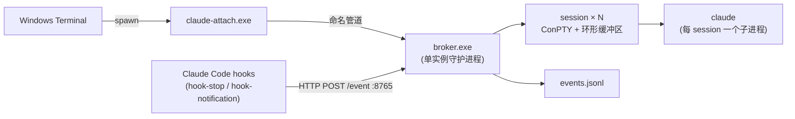

<p align="center">
  <h1 align="center">agentmux</h1>
  <p align="center">
    <strong>面向 Claude Code 的 tmux 式多路复用器：可分离的 PTY 会话、HTTP 控制面、hook 驱动的事件流。</strong>
  </p>
  <p align="center">
    
    
    <a href="https://claude.ai/code"></a>
    <a href="README.md"></a>
  </p>
</p>

---

agentmux 把 Claude Code 改造成一个常驻的多会话后台服务。一个长期运行的 broker 守护进程为每个 session 持有一个 ConPTY 和它内部的 `claude` 子进程；查看器（`claude-attach.exe`）随用随开、随手关闭，不会打扰正在跑的模型。关掉终端窗口不会杀掉 session —— 下次重新打开、从菜单里选回那个 session，最近 ~512 KB 的 TUI 输出会被回放，看到的就是当前画面，而不是一个空白提示符。

## 亮点

- **Session 比 viewer 活得久。** 每个 session 拥有自己的 ConPTY 和环形缓冲区；关掉 Windows Terminal 窗口只是断开 viewer，broker、PTY 和 `claude` 子进程毫发无伤。下次 attach 回来，环形缓冲区把最后一屏回放出来，TUI 就停在对话中——不需要 `--resume`，也不用翻 scrollback。
- **多会话，菜单切换。** 同时跑 N 个 `claude` 实例，每个有独立的 cwd、历史和 Claude session id。`claude-attach.exe` 启动时弹出会话选择菜单（`--new [NAME]` 创建，`--session NAME` 跳过菜单）。同一个 session 可以被多个 viewer 同时 attach —— 输入按到达顺序合流，resize 协调到最小窗口尺寸，避免 claude 在小窗口里溢出。
- **Ctrl+C 升级机制。** 在 raw 终端模式下，viewer 在 1.5 秒滑动窗口内统计 Ctrl+C 次数：**1 次** → 转发 `0x03` 给 claude（中断当前回合）；**2 次** → 重启底层 claude 进程；**3 次** → 关闭整个 broker。**Ctrl+Q** / **Ctrl+]** 仅断开当前 viewer。不需要记 `!stop` / `!kill` 这类自定义语法。
- **HTTP 控制面。** `127.0.0.1:8765` 暴露 sessions 的 CRUD 以及 `/state`、`/interrupt`、`/restart`、`/hibernate`、`/shutdown` —— 外部自动化无需通过 TUI 即可驱动 session。
- **Hook 驱动的事件流。** `hook-stop.exe` 与 `hook-notification.exe` 接入 Claude Code 用户级 `settings.json`，把 `assistant_message` / `notification` 事件 POST 给 broker，broker 把它们追加到 `events.jsonl`，供下游消费（IM 桥、Dashboard 等）。Hook 通过 `AGENT_SESSION_ID` 哨兵识别非 broker 启动的 claude 直接静默退出；当本地有 viewer 已 attach 时也跳过通知 —— 不会重复打扰。
- **休眠与恢复。** 空闲超过 `hibernate_idle_secs` 的 session 会关闭 `claude` 子进程释放内存，但元信息保留在 `sessions.toml`，下次 attach 通过 `claude --resume <session-id>` 拉回原样。
- **单实例 broker、按天滚动日志。** `%LOCALAPPDATA%\agentmux\` 下的 PID 文件阻止两个 broker 抢同一个管道；日志在 `%LOCALAPPDATA%\agentmux\logs\` 下按天滚动，保留 7 天。

## 架构



## 快速开始

### 1. 构建

```powershell
git clone https://github.com/<your-fork>/agentmux.git
cd agentmux
cargo build --release
```

产物：`target/release/{broker,claude-attach,hook-stop,hook-notification}.exe`。

### 2. 启动 broker

```powershell
.\scripts\start-broker.ps1
# broker started: pid 12345
#   cwd:    G:\Claude\agentmux
#   pid:    C:\Users\<you>\AppData\Local\agentmux\broker.pid
#   logs:   C:\Users\<you>\AppData\Local\agentmux\logs
```

broker 的工作目录会成为 `claude` 的 cwd —— 决定"trust this directory?"提示的对象，以及模型看到的项目。要切换目录，先停掉 broker（`.\scripts\stop-broker.ps1`），再用 `-WorkingDirectory <路径>` 重启。

### 3. 安装 hooks（一次性，可选）

```powershell
.\scripts\install-hooks.ps1
```

幂等地合并进 `~\.claude\settings.json`（首次会备份到 `settings.json.bak`）。装完之后，机器上任意位置启动的 `claude` 都会触发 hooks —— 但只有 broker 启动的 session（设置了 `AGENT_SESSION_ID`）才会真正上报，其他静默退出。卸载用 `.\scripts\install-hooks.ps1 -Uninstall`。

### 4. 添加 Windows Terminal profile（可选）

`scripts/terminal-profile.json` 是一段 profile 模板 —— 把里面的 `<INSTALL_DIR>` 替换为你的 agentmux 仓库绝对路径，再把整个对象粘进 Windows Terminal 的 `settings.json` 的 `profiles.list` 数组。选择 "agentmux" profile 即可一键启动 `claude-attach.exe` 进入会话菜单。

### 5. 接入 session

```powershell
.\target\release\claude-attach.exe                # 弹菜单选
.\target\release\claude-attach.exe --session foo  # 直接 attach 到 "foo"
.\target\release\claude-attach.exe --new bar      # 创建 "bar" 并 attach
```

按 **Ctrl+Q** 或 **Ctrl+]** 断开 viewer，或直接关掉终端窗口 —— session 继续跑。下次 attach 回来，环形缓冲区会把最后一屏重新画出来。

## 配置

`broker.exe` 和 `claude-attach.exe` 按以下顺序加载配置（命中即停）：

1. `AGENT_CONFIG` 环境变量 → 指定文件路径
2. `%LOCALAPPDATA%\agentmux\config.toml`
3. 内建默认值

`.\scripts\init-config.ps1` 会在默认路径写一份注释齐全的模板。所有字段都可选 —— 不写就用默认。

| 键 | 默认 | 含义 |
|---|---|---|
| `http_addr` | `127.0.0.1:8765` | broker HTTP 控制面绑定地址 |
| `pipe_name` | `\\.\pipe\claude-broker` | broker 与 viewer 之间的命名管道 |
| `default_command` | `["claude", "--dangerously-skip-permissions"]` | 启动新 session 用的 argv |
| `ring_cap_bytes` | `524288` | 每个 session 的回放缓冲区大小 |
| `hibernate_idle_secs` | `86400` | 空闲超过多少秒自动休眠（0 = 关闭） |
| `sessions_toml_path` | `%LOCALAPPDATA%\agentmux\sessions.toml` | session 持久化文件路径 |
| `pid_file_path` | `%LOCALAPPDATA%\agentmux\broker.pid` | 单实例锁文件路径 |
| `log_dir` | `%LOCALAPPDATA%\agentmux\logs` | 按天滚动日志目录 |

## HTTP API

| 方法 | 路径 | 用途 |
|---|---|---|
| `GET` | `/sessions` | 列出所有 session（id、name、cwd、viewers、state） |
| `POST` | `/sessions` | 创建 session（`{"name", "cwd"?, "command"?}`） |
| `GET` | `/sessions/:key` | 查询单个 session（key 可以是 id 或 name） |
| `DELETE` | `/sessions/:key?force=true` | 杀掉 session |
| `GET` | `/sessions/:key/state` | 轻量探针：存活 / 空闲 / viewer 数 |
| `POST` | `/sessions/:key/interrupt` | 给 session 的 PTY 写 `0x03`（等同于在 claude 里按 Ctrl+C） |
| `POST` | `/sessions/:key/restart` | 杀掉并重启 claude 子进程，保留 session id |
| `POST` | `/sessions/:key/hibernate` | 关闭 claude 子进程但保留元信息，待下次 resume |
| `POST` | `/event` | hook 摄入端点 —— 追加一行到 `events.jsonl` |
| `POST` | `/shutdown` | broker 优雅关闭（给所有 claude 发 SIGTERM、排空、退出） |

## Crate 一览

| Crate | 职责 |
|---|---|
| `broker` | 多会话守护进程。负责 ConPTY 池、环形缓冲区、命名管道服务、HTTP 控制面、休眠扫描、崩溃看护、`events.jsonl` 写入 |
| `claude-attach` | 终端 viewer。基于命名管道的帧协议客户端，含会话选择菜单、raw 模式 stdin 转发、Ctrl+C 升级、resize 协调 |
| `hook-stop` | Claude Code `Stop` hook。读 transcript，向 broker POST `assistant_message`。本地 viewer 已 attach 时静默 |
| `hook-notification` | Claude Code `Notification` hook。向 broker POST `notification` 事件 |
| `shared` | 帧协议（HELLO / RESIZE / CONTROL / PTY_DATA 等 tag）、配置加载器、最小阻塞式 HTTP 客户端 |

## 仓库结构

```
agentmux/
├── crates/
│   ├── broker/             # 多会话守护进程
│   ├── claude-attach/      # 终端 viewer
│   ├── hook-stop/          # Stop hook → assistant_message
│   ├── hook-notification/  # Notification hook → notification
│   └── shared/             # 帧协议 + 配置 + HTTP 客户端
├── scripts/
│   ├── start-broker.ps1
│   ├── stop-broker.ps1
│   ├── install-hooks.ps1
│   ├── init-config.ps1
│   ├── open-config-dir.ps1
│   └── terminal-profile.json   # Windows Terminal profile 模板
└── PLAN.md                 # 设计文档 + 阶段实施日志
```

## 系统要求

- **Windows 10/11** —— 依赖 ConPTY 与 Win32 命名管道，不可移植到 Unix
- **Rust 1.75+** 用于编译
- **Claude Code CLI** 已加入 `PATH` —— broker 默认拉起 `claude`

## 安全

- HTTP 控制面与命名管道**仅绑 loopback / 本机**，外网不可达。
- 默认启动命令是 `claude --dangerously-skip-permissions`。如不希望跳过权限，编辑 `config.toml` 里的 `default_command`。
- PID 文件单实例锁防止两个 broker 抢同一根管道。

## 许可证

待定。
