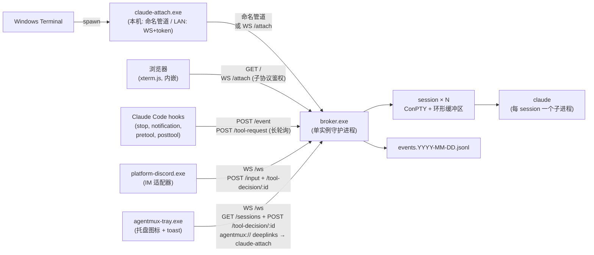

<p align="center">
  <h1 align="center">agentmux</h1>
  <p align="center">
    <strong>面向 Claude Code 的 tmux 式多路复用器：可分离的 PTY 会话、HTTP 控制面、hook 驱动的事件流。</strong>
  </p>
  <p align="center">
    
    
    <a href="https://claude.ai/code"></a>
    <a href="README.md"></a>
  </p>
</p>

---

agentmux 把 Claude Code 改造成一个常驻的多会话后台服务。一个长期运行的 broker 守护进程为每个 session 持有一个 ConPTY 和它内部的 `claude` 子进程；查看器（`claude-attach.exe`）随用随开、随手关闭，不会打扰正在跑的模型。关掉终端窗口不会杀掉 session —— 下次重新打开、从菜单里选回那个 session，最近 ~512 KB 的 TUI 输出会被回放，看到的就是当前画面，而不是一个空白提示符。

## 亮点

- **Session 比 viewer 活得久。** 每个 session 拥有自己的 ConPTY 和环形缓冲区；关掉 Windows Terminal 窗口只是断开 viewer，broker、PTY 和 `claude` 子进程毫发无伤。下次 attach 回来，环形缓冲区把最后一屏回放出来，TUI 就停在对话中——不需要 `--resume`，也不用翻 scrollback。
- **多会话，菜单切换。** 同时跑 N 个 `claude` 实例，每个有独立的 cwd、历史和 Claude session id。`claude-attach.exe` 启动时弹出会话选择菜单（`--new [NAME]` 创建，`--session NAME` 跳过菜单）。同一个 session 可以被多个 viewer 同时 attach —— 输入按到达顺序合流，resize 协调到最小窗口尺寸，避免 claude 在小窗口里溢出。
- **Ctrl+C 升级机制。** 在 raw 终端模式下，viewer 在 1.5 秒滑动窗口内统计 Ctrl+C 次数：**1 次** → 转发 `0x03` 给 claude（中断当前回合）；**2 次** → 重启底层 claude 进程；**3 次** → 关闭整个 broker。**Ctrl+Q** / **Ctrl+]** 仅断开当前 viewer。
- **HTTP 控制面 + WS 事件总线。** `127.0.0.1:8765` 暴露完整生命周期（`/sessions` CRUD、`/interrupt` `/restart` `/hibernate` `/input` `/persist`）、`/event` hook 摄入端点、`/ws` 事件订阅、`/tool-request` PreToolUse 同步审批长轮询，以及 `/attach` 远程 viewer 接入（详见下文 *局域网远程接入*）。
- **内建 Discord IM 桥。** `platform-discord.exe` 订阅 WS 事件总线，把 Discord 消息回送 `/sessions/:id/input`。包括：
  - **每频道独立 session 绑定** —— 一个 Discord 频道映射一个 session，绑定关系持久化到磁盘，bot 重启不丢
  - **就地编辑式回复 + 实时进度流** —— 每条 forward 消息立即收到 `💭 working…` 占位回复。claude 每跑一个工具（Edit / Bash / Grep / WebFetch / …），`PostToolUse` hook 触发后 broker 推送 `tool_progress` 事件，bot 把占位符就地编辑出一条人话 timeline（`✏️ edit src/x.rs`、`🖥 $ cargo test`、`🔎 grep …`）。turn 完成后整条 timeline 被替换成 claude 的最终回答。每条占位符 800ms 节流,即便高频工具调用也不爆 Discord 编辑限流。
  - **Reply 路由** —— Discord 引用某条旧的 assistant message 发新消息，本轮自动转给*那条消息所属的 session*；可选附带引用文本作为上下文
  - **Reaction 命令** —— 给 bot 任意消息加 🛑 / 💤 / 🔄，立即 interrupt / hibernate / restart 对应 session
  - **`@mention` 唤醒** —— 可选开启，让 bot 在白名单外的频道也能通过 @ 唤起
  - **DM 模式** —— 可选开启，与白名单用户 1:1 私聊
  - **附件转发** —— Discord 拖图进聊天，bot 落到本地 temp 并提示 claude 用 `Read` 工具看图；文本附件同理
  - **12 个 slash 命令**，session 名自动补全：`/ls /attach /new /persist /kill /interrupt /restart /hibernate /logs /cwd /status /help`
  - **Idle ping 默认抑制**（claude 的"等待输入"通知不打扰；权限提示等其它 notification 仍正常转发）
- **系统托盘 + Windows toast(无需 IM)。** `agentmux-tray.exe` 与 broker 同进同退，给你一个**常驻托盘图标**,颜色编码 session 状态(绿=idle / 黄=running / 红=待审批或 crash / 灰=broker 离线)。右键展开 per-session 子菜单(Attach / Interrupt / Hibernate / Restart / Kill)、Open web viewer、Stop broker。Toast 在三种事件时弹出:`assistant_message`(点正文走 `agentmux://` URL scheme 启动 `claude-attach`)、`notification`、以及杀手级的 `tool_request`(自带 **`[Allow]` / `[Deny]` 按钮**)。tray 与 Discord **并行**:谁先点谁赢,broker 的 `/tool-decision/:id` 幂等。命名管道做单实例握手。结果:在桌前的时候**几乎不用切到 Discord 也能审批**。
- **Hook 驱动的事件流。** 四个 hook 接入 Claude Code 用户级 `settings.json`：
  - `hook-stop` —— claude 完成 turn 时 POST `assistant_message`
  - `hook-notification` —— 权限提示 / idle ping → POST `notification`
  - `hook-pretool` —— 工具调用**前**同步触发；放行安全工具（Read / Glob / Grep / `cargo` / `git status` / …），高危操作（`rm -rf`、`curl | sh`、session cwd 外的 Edit / Write 等）走 Discord / toast 审批
  - `hook-posttool` —— 工具调用**后**触发，POST `tool_progress` 事件驱动 Discord 的就地编辑式进度流
  四个 hook 都通过 `AGENT_SESSION_ID` 哨兵识别非 broker 启动的 claude 直接静默退出；本地有 viewer 已 attach 时也跳过 —— 不重复打扰。
- **工具审批,两面通吃。** `hook-pretool` 决定要问时，broker **同时**把 `tool_request` 推到 Discord(`✅ Allow` / `❌ Deny` 按钮卡)和本地 tray(Windows toast,带同样按钮,通过 `agentmux://` URL scheme 回路)。hook 在 `/tool-request` 上长轮询最长 5 分钟；任一端点先 POST `/tool-decision/:id` 即赢，broker 对落败者幂等返回 404。绝大多数 turn 触发零个审批；只有真正高危操作才打扰你。
- **Hibernate / resume + 持久化开关。** 空闲超过 `hibernate_idle_secs` 的 session 关掉 `claude` 子进程释放内存，元信息留在 `sessions.toml`，下次 `/input`（或 attach）通过 `claude --resume <session-id>` 拉回。auto-resume 等 TUI 画面稳定后再注入输入，避免休眠后第一条 IM 消息被启动期吞掉。新建 session 默认是*短暂*的（broker 重启后忘记）—— 用 `!persist on` / `/persist` / `-persist` 标志切换。
- **局域网远程接入（可选开启）。** 设置 `attach_token` 并把 `http_addr` 绑到 `0.0.0.0:8765`，第二台机器就能用 `claude-attach --broker http://host:8765 --token <…>` 通过 WebSocket 接入。回环调用方（同机现有工具）跳过鉴权；非回环调用方必须带 `Authorization: Bearer <token>`。
- **浏览器 web viewer。** 任何设备（笔记本、手机、平板）打开 `http://<broker>:8765/` 都能 attach —— 单文件 HTML 由 broker.exe 直接 serve，xterm.js 和 fit addon 通过 `include_bytes!` **嵌入** broker 二进制（不走 CDN，离线 / 隔离网络也能用）。Token 输入存 localStorage，回环浏览器跳过 token 提问。WebSocket 自带指数退避重连（broker 重启不丢 scrollback）。触屏设备底部出软键盘条（Esc / Tab / 方向键 / `^C` `^D` `^L` `^Z`），补全虚拟键盘缺失的键。WS 鉴权用 `Sec-WebSocket-Protocol: bearer.<token>` 子协议（浏览器没法在 WebSocket 上设 Authorization header）。
- **一行命令安装。** `.\agentmux init` 走交互式向导。日常用 `.\agentmux start | stop | status | attach | logs | config | discord` 一套子命令；配置编辑通过 `agentmux-cli` 保留注释和格式。`.\agentmux config token --set` 一键生成 32 字节随机 token 并写入 `broker.toml`。
- **broker 单实例 + 按天日志 + 审计日志。** PID 文件防止两个 broker 抢同一根管道；`broker.YYYY-MM-DD.log` 和 `events.YYYY-MM-DD.jsonl` 在 `%LOCALAPPDATA%\agentmux\` 下按天滚动，保留 7 天。

## 架构



## 快速开始

终端用户路径详见 **[QUICKSTART.md](QUICKSTART.md)** —— 下载 release zip、解压、跑 `.\agentmux init`。下面是开发 / 源码构建路径。

### 1. 构建

```powershell
git clone https://github.com/<your-fork>/agentmux.git
cd agentmux
cargo build --release
```

产物：`target\release\` 下 9 个 binary —— `broker`、`claude-attach`、`hook-stop`、`hook-notification`、`hook-pretool`、`hook-posttool`、`platform-discord`、`agentmux-tray`、`agentmux-cli`。

### 2. 首次设置

```powershell
.\agentmux init
```

交互式向导：先决条件检查 → 装 hooks → 写 broker config 模板 → 可选 Discord 设置 → 启动 broker。幂等的，可随时重跑，已完成的步骤会跳过。

### 3. 日常运维

```powershell
.\agentmux start             # broker + tray + Discord bot(如已配置)
.\agentmux stop              # 全部停掉
.\agentmux status            # 一行健康摘要
.\agentmux attach [name]     # 进 TUI；不传名字走菜单选择
.\agentmux logs broker       # 还可:discord / tray / events
.\agentmux help              # 完整命令列表
```

`start` 之后**看 Windows 任务栏右下角(系统托盘区域)** —— 一个小圆点就是 agentmux tray。右键看 per-session 菜单;`assistant_message` 和工具审批通过 toast 弹出。`--no-tray` 跳过 tray,`--no-discord` 跳过 Discord bot。

`.\agentmux start --foreground` 让 broker 直接在当前 shell 里跑（Ctrl+C 退出），方便调试 —— panic 和 tracing 输出直接在终端里看到，不去日志文件。

要在任意设备(无需装东西、手机也行)用浏览器 attach,broker 跑起来之后打开 `http://<broker>:8765/`。回环浏览器跳过 token 提问;LAN 浏览器粘贴跟 `claude-attach --broker` 同一个 `attach_token`。

### 4. 配置助手

```powershell
.\agentmux config check                     # 校验所有配置
.\agentmux config edit [broker|discord|hooks]
.\agentmux config dir                       # 在 Explorer 里打开 %LOCALAPPDATA%\agentmux
.\agentmux config set broker http_addr 127.0.0.1:9000
.\agentmux config token --set               # 生成 + 写入 LAN 接入 token
.\agentmux discord users add  123456789012345678
.\agentmux discord channels remove 987654321098765432
```

TOML 编辑通过 `agentmux-cli` 进行，保留原有注释和格式。`config check` 解析每份配置并报告 `✓` / `⚠` / `✗`，方便复制到 bug report 里。

### 5. Discord 命令速查

任何 bot 能读到的频道里（纯文本或 `!`-前缀；slash 命令也能用，session 名自动补全）：

```
纯文本                       → 转发到本频道绑定的 session
!attach <name>               → 把本频道绑到指定 session（/attach 自带补全）
!new [name] [-cwd path]      → 创建 session 并绑（-ephemeral / -persist 覆盖默认）
!persist on | off            → 切换本频道 session 的"broker 重启后是否恢复"
!cwd                         → 显示绑定 session 的工作目录
!logs [n]                    → 末 n 行 session 输出（默认 30，最大 100）
!ls                          → 列出所有 session；▶ 标记本频道绑的；下面列出其它频道→session 映射
!status                      → 显示本频道当前绑定
!interrupt | !restart | !hibernate
!kill <name>                 → 销毁 session（/kill 自带补全），相关频道失去绑定
!help                        → 上面所有命令
```

给 bot 任意消息加 **🛑** (interrupt) / **💤** (hibernate) / **🔄** (restart) 反应，等同于对应命令但不用打字。

回复 (Discord 的 reply UI) bot 的某条消息，本轮 forward 自动指向那条消息当时对应的 session，与本频道当前绑定无关。

### 6. 局域网远程接入

```powershell
# 在 broker 主机上：
.\agentmux config token --set                                # 生成并保存 token
.\agentmux config set broker http_addr "0.0.0.0:8765"        # 监听 LAN
.\agentmux stop ; .\agentmux start                           # 应用
# Windows Defender 防火墙允许 8765 入站，限制到本子网即可。

# 在第二台机器上（用上面生成的 token）：
$env:AGENT_ATTACH_TOKEN = "rjVBS19l...43字符..."
.\claude-attach.exe --broker http://192.168.0.42:8765 --session default
```

回环调用方（broker 同机的 Discord bot、hooks、本地 `claude-attach`）跳过 token 校验，所以现有本地工具一行配置不动也照常工作。

### 7. 切版本

```powershell
.\scripts\build-release.ps1
# → dist\agentmux-vX.Y.Z-windows-x86_64.zip
```

推 `v*` tag 触发 `.github/workflows/release.yml`，在 Windows runner 上跑同一份 packaging 脚本，把 zip + `.sha256` 校验和上传到 GitHub Release。（也支持 `workflow_dispatch` 手动触发。）

### 8. Windows Terminal 配置（可选）

`scripts/terminal-profile.json` 是一段 profile 模板 —— 把 `<INSTALL_DIR>` 替换为你的 agentmux 仓库绝对路径，整个对象粘进 Windows Terminal 的 `settings.json` 的 `profiles.list`。选中 "agentmux" profile 即可一键拉起 `claude-attach.exe` 进入会话菜单。

## 配置

`broker.exe` 和 `claude-attach.exe` 按以下顺序加载配置（命中即停）：

1. `AGENT_CONFIG` 环境变量 → 指定文件路径
2. `%LOCALAPPDATA%\agentmux\config.toml`
3. 内建默认值

`.\scripts\init-config.ps1` 在默认路径写一份注释齐全的模板。所有字段都可选 —— 不写就用默认。

### `broker` 配置（`config.toml`）

| 键 | 默认 | 含义 |
|---|---|---|
| `http_addr` | `127.0.0.1:8765` | Broker HTTP / WS 绑定地址。设为 `0.0.0.0:8765` 开 LAN（**此时 `attach_token` 必须设置**）。 |
| `pipe_name` | `\\.\pipe\claude-broker` | broker 与本地 viewer 之间的命名管道 |
| `default_command` | `["claude", "--dangerously-skip-permissions"]` | 启动新 session 用的 argv |
| `ring_cap_bytes` | `524288` | 每个 session 的回放缓冲区大小 |
| `hibernate_idle_secs` | `86400` | 空闲超过多少秒自动休眠（0 = 关闭） |
| `auto_resume_default` | `false` | 为 `true` 时新 session 默认持久化；per-session 标志仍优先 |
| `attach_token` | (空) | 非回环 HTTP/WS 的 Bearer token。空 = 禁用 LAN 接入。用 `.\agentmux config token --set` 生成 |
| `sessions_toml_path` | `%LOCALAPPDATA%\agentmux\sessions.toml` | session 持久化文件路径 |
| `pid_file_path` | `%LOCALAPPDATA%\agentmux\broker.pid` | 单实例锁文件路径 |
| `log_dir` | `%LOCALAPPDATA%\agentmux\logs` | 按天滚动日志目录 |

### `discord` 配置（`discord.toml`）

| 键 | 默认 | 含义 |
|---|---|---|
| `token_env` | `DISCORD_BOT_TOKEN` | 存放 bot token 的环境变量名（token 永不写盘） |
| `broker_http_url` | `http://127.0.0.1:8765` | broker HTTP 基址；跨机部署时改 host |
| `broker_ws_url` | `ws://127.0.0.1:8765/ws` | broker WS 事件流 |
| `channel_ids` | `[]` | 白名单 server 频道 ID（空 = 监听所有可见 server 频道） |
| `allowed_user_ids` | `[]` | **必填、非空。** bot 接受其消息的 Discord 用户 ID 白名单 |
| `default_session` | `default` | 新频道首次说话时自动绑到的 session |
| `max_message_chars` | `1900` | Discord 单条 2000 字符上限的拆分点（留 100 给装饰） |
| `allow_dm` | `false` | 是否接受白名单用户的 1:1 私信 |
| `notify_on_idle` | `false` | 是否转发 "Claude is waiting for your input" 这类 idle ping（多数人嫌吵） |
| `respond_to_mentions` | `false` | 非白名单频道里 `@bot` 也能唤醒 bot |
| `slash_command_guild_id` | `0` | 把 slash 命令 pin 到某 guild 实现即时刷新（0 = 全局，最多 1h 传播） |
| `reply_quote_in_prompt` | `true` | Discord reply 前置 `[replying to: "..."]` 让 claude 看到引用上下文 |
| `react_with_actions` | `true` | 给 bot 消息加 🛑 / 💤 / 🔄 反应触发 interrupt / hibernate / restart |

## HTTP API

所有 endpoint 默认仅回环可达。当 `attach_token` 设置且 `http_addr` 绑定到非回环地址时，非回环调用方必须带 `Authorization: Bearer <attach_token>`。

| 方法 | 路径 | 用途 |
|---|---|---|
| `GET` | `/sessions` | 列出所有 session（id、name、cwd、viewers、state、auto_resume） |
| `POST` | `/sessions` | 创建 session（`{"name", "cwd"?, "auto_resume"?}`）；`auto_resume` 缺省取 `auto_resume_default` |
| `GET` | `/sessions/:key` | 查询单个 session（key 可以是 id 或 name） |
| `DELETE` | `/sessions/:key?force=true` | 杀掉 session |
| `GET` | `/sessions/:key/state` | 轻量探针：存活 / 空闲 / viewer 数 |
| `POST` | `/sessions/:key/interrupt` | 给 session 的 PTY 写 `0x03`（等同于在 claude 里按 Ctrl+C） |
| `POST` | `/sessions/:key/restart` | 杀掉并重启 claude 子进程，保留 session id |
| `POST` | `/sessions/:key/hibernate` | 关闭 claude 子进程但保留元信息，待下次 resume |
| `POST` | `/sessions/:key/input` | 注入文本到 session 的 PTY stdin（`{"text", "append_enter"?}`）。`Hibernated/Crashed` 自动 resume；末尾 `\r` 与文本分两次写、间隔 30ms，避免 claude TUI 把它们当成 paste-burst 而不 submit |
| `POST` | `/sessions/:key/persist` | 切换 session 的 `auto_resume` 标志（`{"auto_resume": bool}`），重写 sessions.toml |
| `GET` | `/sessions/:key/ring` | 诊断：环形缓冲区原始字节快照 —— 配合 `xxd` / `od -c` 看 |
| `POST` | `/event` | hook 摄入端点 —— 追加到 `events.YYYY-MM-DD.jsonl`，并 tee 到 `/ws` |
| `POST` | `/tool-request` | **长轮询，最长 5 分钟。** hook-pretool 发 `{ session_id, tool_name, tool_input }`；broker 生成 UUID、广播 `tool_request` 事件，等待 `/tool-decision/:id`，返回 `{ allow, reason }`。超时返回 `{ allow: false, reason: "no human decision within 300s" }` |
| `POST` | `/tool-decision/:request_id` | 解开一条挂起的 `/tool-request`（`{"allow": bool, "reason"?}`） |
| `GET` | `/ws` | WebSocket 事件总线 —— 每个标注好的 hook 事件以一行 JSON 推给订阅者 |
| `GET` | `/attach` | WebSocket viewer 接入。每条帧（HELLO / PTY_DATA / RESIZE / CONTROL）作为一个 Binary 消息。LAN 上的 `claude-attach --broker` 和浏览器 viewer 都走这条(浏览器用 `Sec-WebSocket-Protocol: bearer.<token>` 子协议鉴权,因为 WebSocket 没法设 `Authorization` header) |
| `GET` | `/`、`/web`、`/web/` | 浏览器 web viewer 主页 —— 单文件 HTML 直接由 broker.exe 提供。**Public** 不走鉴权(用户得先打开页面才能粘 token);页面里的特权调用(`/sessions`、`/attach`)依然走 auth middleware |
| `GET` | `/web/vendor/*` | 嵌入的 xterm.js + addon-fit + xterm.css(~290 KB,通过 `include_bytes!` 入二进制),带 `Cache-Control: public, max-age=86400` |
| `POST` | `/shutdown` | broker 优雅关闭(杀光所有 claude、排空、退出) |

## Crate 一览

| Crate | 职责 |
|---|---|
| `broker` | 多会话守护进程。负责 ConPTY 池、环形缓冲区、命名管道服务、HTTP 控制面（带 auth 中间件保护）、WS 事件总线、WS attach 端点、休眠扫描、PreToolUse 决策通道注册表、按天滚动审计日志 |
| `claude-attach` | 终端 viewer。基于帧协议的客户端，两条 transport：命名管道（默认本机）+ WebSocket（`--broker http://host:port --token …` 走 LAN）。会话选择菜单、raw 模式 stdin 转发、Ctrl+C 升级、resize 协调 |
| `platform-discord` | Discord IM 适配器。每频道独立 session 绑定（持久化），就地编辑式 placeholder + 实时工具进度流、Reply 路由 + 引用上下文、附件转发、12 个 slash 命令带补全、reaction 命令、工具审批按钮、idle ping 抑制、@mention 唤醒、DM 模式、孤儿 placeholder 恢复 |
| `agentmux-tray` | 系统托盘图标 + Windows toast 通知。订阅 `/ws` 拿事件,轮询 `/sessions` 刷新菜单状态。每 session 右键子菜单;`assistant_message` / `notification` / `tool_request` 三种 toast(后者带 `[Allow]` `[Deny]` 按钮,通过 `agentmux://` URL scheme 回投决定到 broker)。命名管道单实例握手,首次启动注册 HKCU URL scheme |
| `hook-stop` | Claude Code `Stop` hook。读 transcript、向 broker POST `assistant_message`。本地 viewer 已 attach 时静默 |
| `hook-notification` | Claude Code `Notification` hook。POST `notification` 事件 |
| `hook-pretool` | Claude Code `PreToolUse` hook。本地分类器自动放行安全工具 + 开发流的 `Bash` 模式；其余长轮询 `/tool-request` 走 Discord / toast 审批。broker 不可达时**失败放行**，避免基础设施故障让 claude 工作中断 |
| `hook-posttool` | Claude Code `PostToolUse` hook。POST `tool_progress` 事件驱动 Discord 占位符的就地编辑(`✏️ edit src/x.rs` / `🖥 $ cargo test` / …)。同样 fail-open + 本地 viewer 在场静默 |
| `agentmux-cli` | 被 `agentmux.ps1` 调用的小工具：保留格式的 TOML 编辑器 + 各类配置校验 |
| `shared` | 帧协议（HELLO / RESIZE / CONTROL / PTY_DATA 等 tag、用于 WS 的 encode/decode-frame）、配置加载器、最小阻塞式 HTTP 客户端（含可选 Bearer 鉴权 + 长轮询版） |

## 仓库结构

```
agentmux/
├── agentmux.ps1            # 统一入口 —— 包装下面那些 scripts
├── QUICKSTART.md           # 一页用户向导
├── crates/
│   ├── broker/             # 多会话守护进程
│   │   └── web/            # 浏览器 viewer(HTML + 内嵌的 xterm.js)
│   ├── claude-attach/      # 终端 viewer (pipe + WS)
│   ├── platform-discord/   # Discord IM 适配器(含工具进度流)
│   ├── agentmux-tray/      # 系统托盘图标 + Windows toast 通知
│   ├── hook-stop/          # Stop hook → assistant_message
│   ├── hook-notification/  # Notification hook → notification
│   ├── hook-pretool/       # PreToolUse hook → tool_request (同步审批)
│   ├── hook-posttool/      # PostToolUse hook → tool_progress (实时进度)
│   ├── agentmux-cli/       # TOML 助手 (config set/check/array-add 等)
│   └── shared/             # 帧协议 + 配置 + HTTP 客户端
├── scripts/
│   ├── start-broker.ps1    # 也支持 -Foreground
│   ├── start-discord.ps1
│   ├── start-tray.ps1
│   ├── stop-broker.ps1
│   ├── install-hooks.ps1
│   ├── init-config.ps1
│   ├── init-discord-config.ps1
│   ├── open-config-dir.ps1
│   ├── build-release.ps1   # 产出 dist\agentmux-vX.Y.Z-windows-x86_64.zip
│   └── terminal-profile.json
├── .github/workflows/
│   └── release.yml         # tag 触发的自动构建 + GitHub release
└── PLAN.md                 # 设计文档 + 阶段实施日志
```

## 系统要求

- **Windows 10/11** —— 依赖 ConPTY 与 Win32 命名管道，不可移植到 Unix
- **Rust 1.75+** + MSVC 工具链（Visual Studio 2022 Build Tools，"Desktop development with C++"），仅构建时需要；release zip 已自包含
- **Claude Code CLI** 在 `PATH` 上 —— broker 默认拉起 `claude`

## 安全

- **默认仅回环。** HTTP 控制面与命名管道开箱即用绑定到 `127.0.0.1`，外网不可达。LAN 接入需要显式开启：`http_addr = "0.0.0.0:8765"` **且** `attach_token` 非空；token 没设的话每个非回环请求都被 401 拒绝（带 source IP 上日志）。
- **Token 比较走 constant-time** 防止时序攻击。
- **回环豁免**：auth 中间件对 127.0.0.1 / ::1 直接放行，所以同机现有工具（同主机的 Discord bot、hooks、命名管道 attach）不需要任何 token 配置仍正常工作。
- **PreToolUse 失败放行。** broker 不可达时，`hook-pretool` 选择放行而不是阻塞 claude。设置 `AGENT_HOOK_DEBUG` 可在 stderr 看到失败原因（人看，claude 看不到）。
- **默认启动命令** 是 `claude --dangerously-skip-permissions`。PreToolUse 审批流的设计目标是用更灵活的正则规则**替代** claude 自己的权限提示；如果你更想用 claude 内置的权限对话框，就在 `config.toml` 里改 `default_command` 并卸载 PreToolUse hook。
- **PID 文件单实例锁**防止两个 broker 抢同一根管道。
- **Discord token 永不写盘。** bot token 存在 User-scope 环境变量里（默认 `DISCORD_BOT_TOKEN`），`discord.toml` 里只放变量*名*。

## 许可证

待定。
